# NCMusic

** Cross-platform music player for mobile, developed using Python **

NCMusic is a music player that mimics the design of Netease Cloud Music UI, and strives to synchronize with the data of Netease Cloud official website, so that users can use the software without losing the existing playlists.

## Installation:
- PC: clone the repository, run main.py after installing dependencies as needed
- Android: directly enter the bin folder and download the .apk file to install

## Description:
The project is still in the development stage, and the implemented functions are:
- Log in with your phone number and sync user nickname, avatar, favorite music
- NetEase cloud native daily song list recommendation
- Native Daily Music Singles Recommendation
- Add favorite / delete favorite songs
- Listen while saving, all songs will be automatically cached after playing, and will be automatically loaded from local when playing again
- Night mode
- Personalized skin

The interfaces that have been basically developed so far are:
- Login interface
- User interface
- Left toolbar
- Playlist recommendation page

The interface has been developed but is not complete (with the required functions but the interface has not been beautified):
- Song details interface (lyrics interface)
- Search interface
- Playlist details page

Interface that has not started or developed very little:
- Video playback interface
- "Friends" "Radio" "Live" "Video" interface

> Explanation for most undeveloped interfaces: No relevant api was found and most users did not have much demand for it.

## Approximate interface display:
### pc 端:

- Login: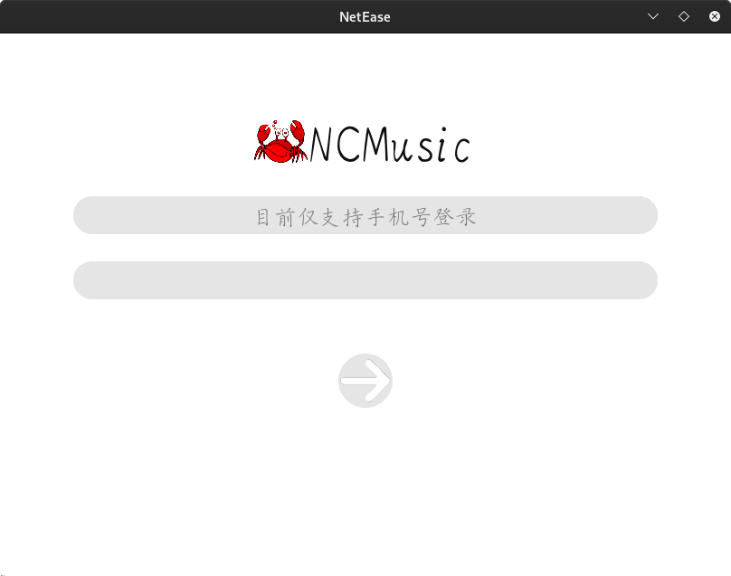
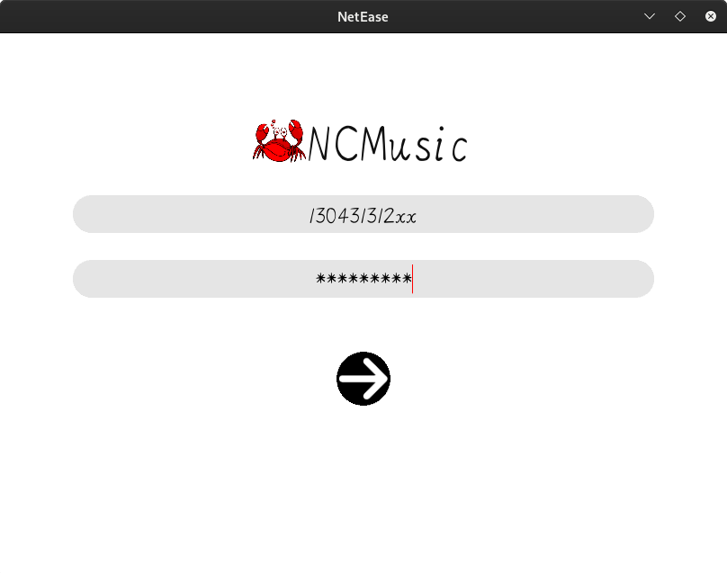
- Main interface: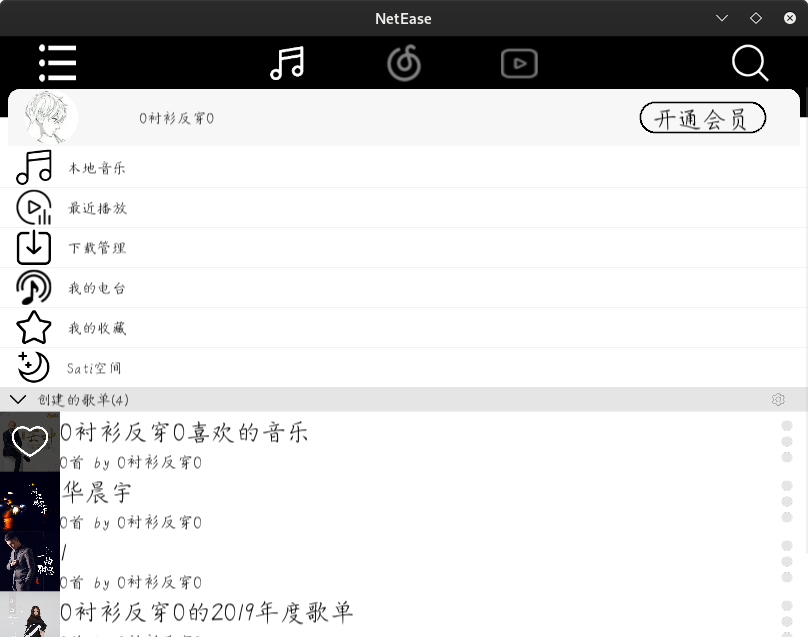
- Sidebar: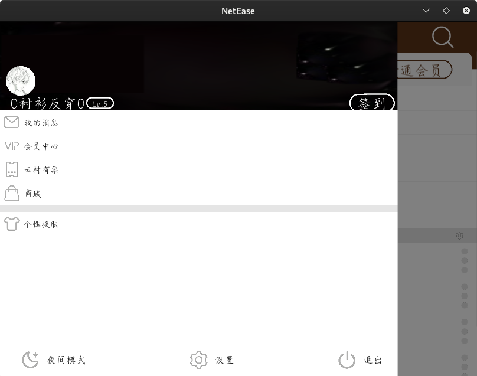
- Recommended playlist:
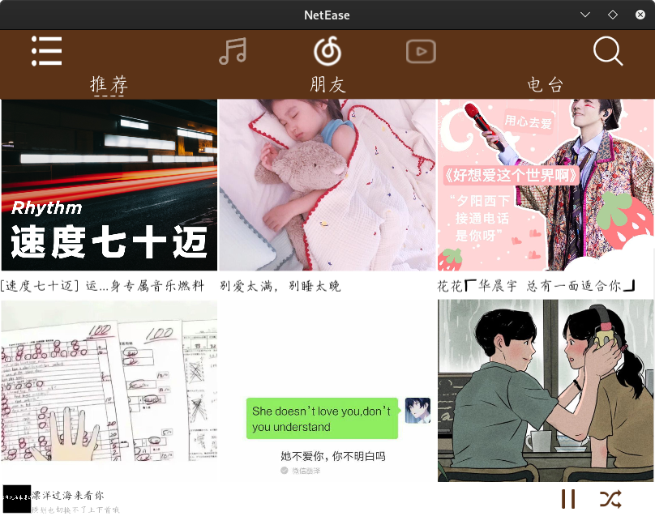
- Song detail page: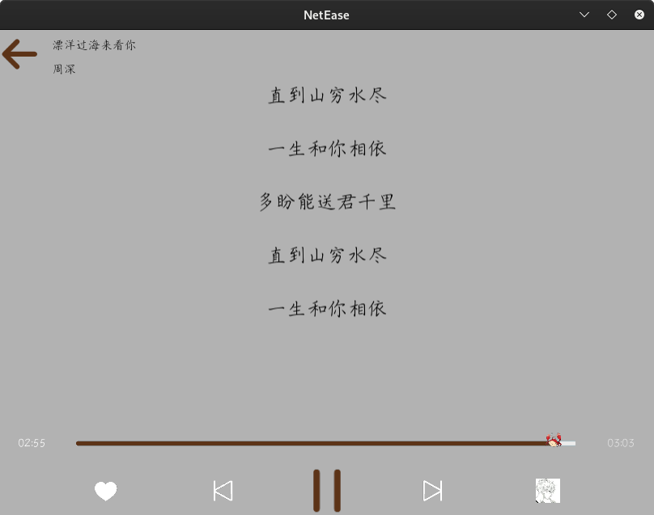
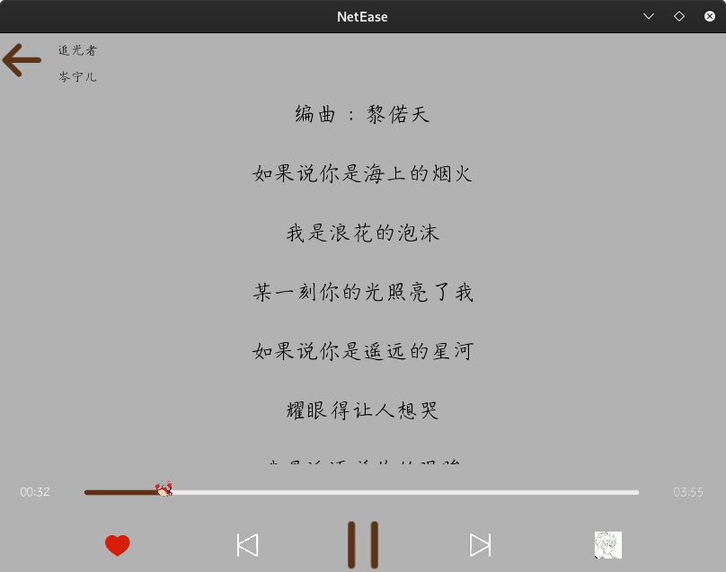
- Playlist detail page: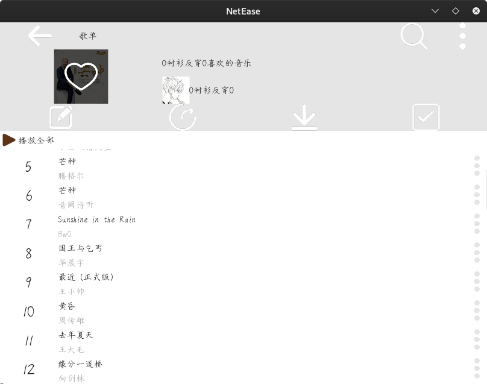
- Search interface: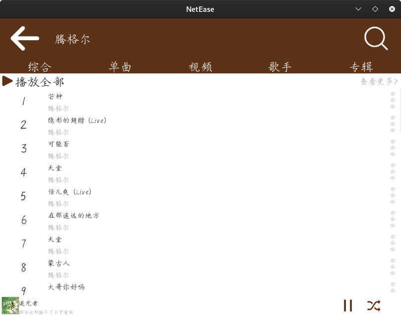
- Night mode: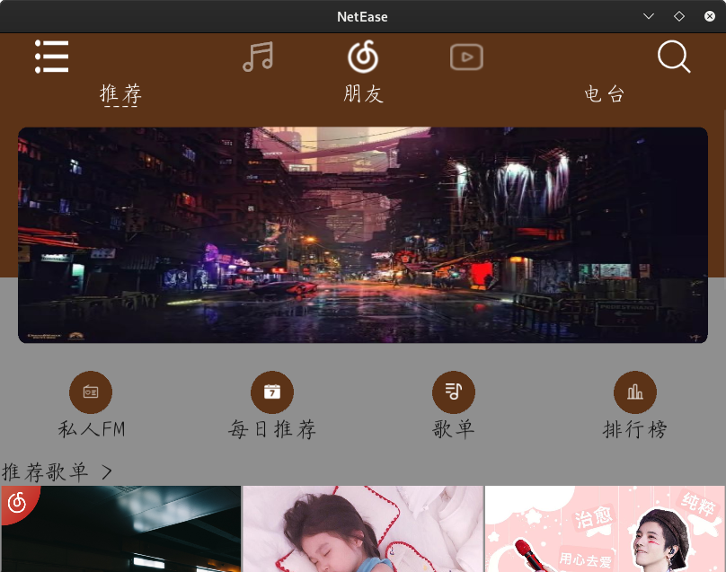
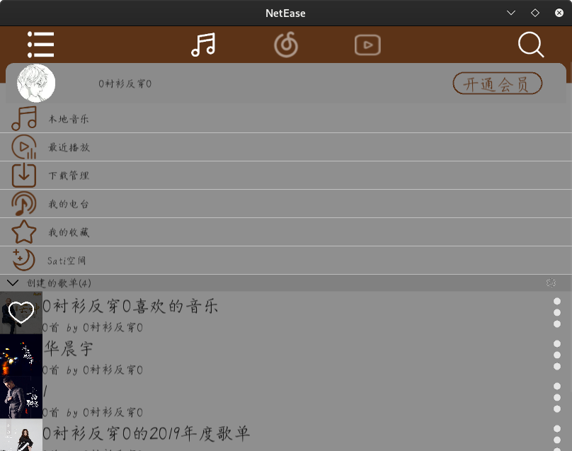

### Android side:
- Login: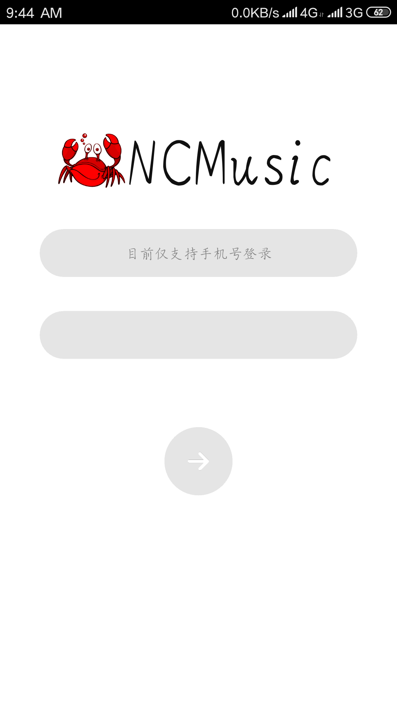
- Main interface: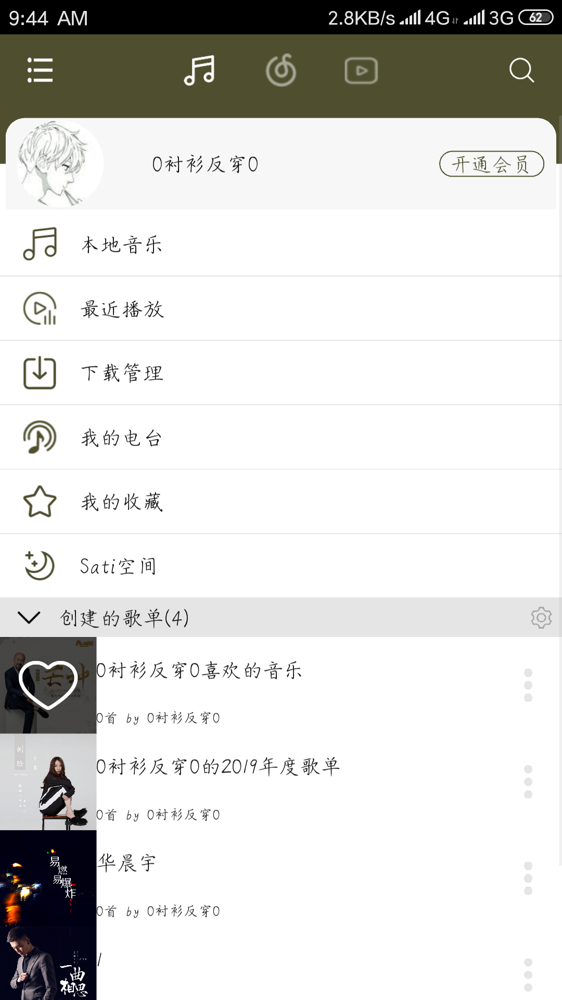
- Sidebar: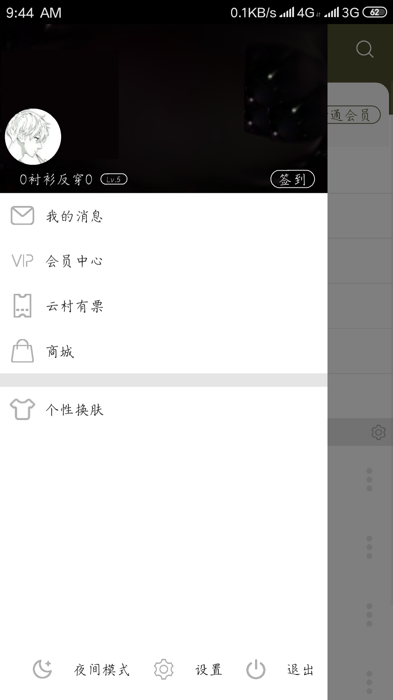
- Recommended playlist: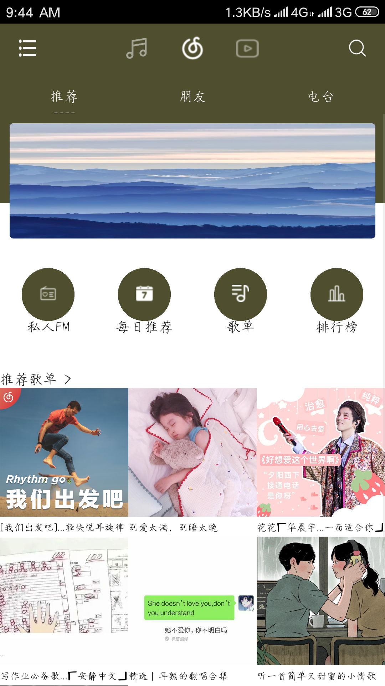
- Song detail page: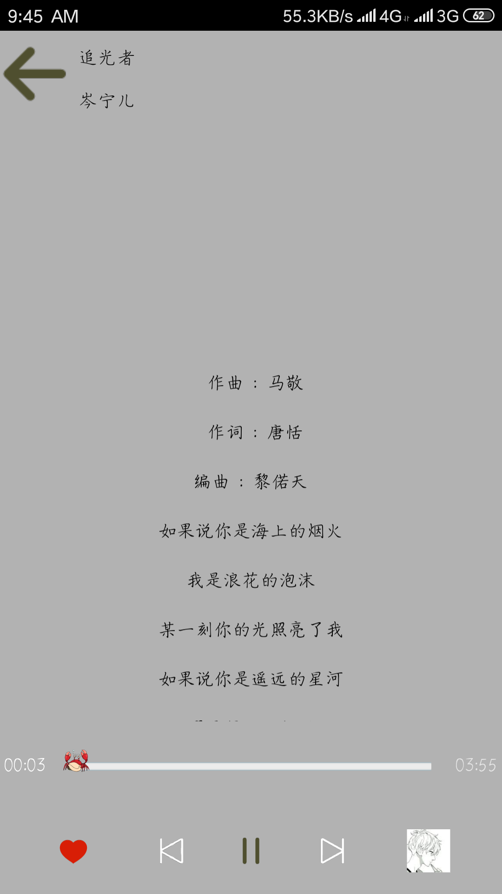
- Playlist detail page: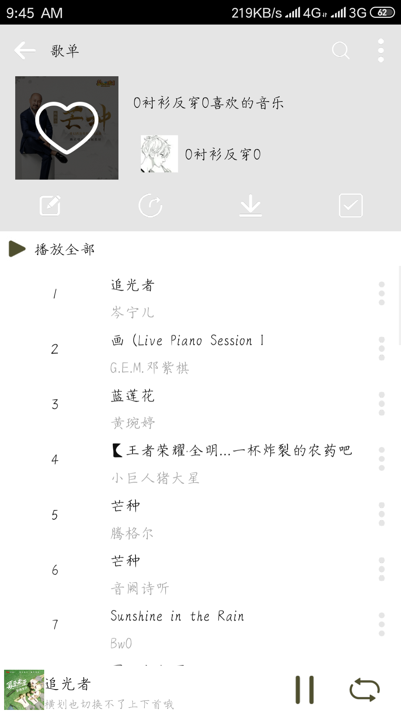
- Search interface: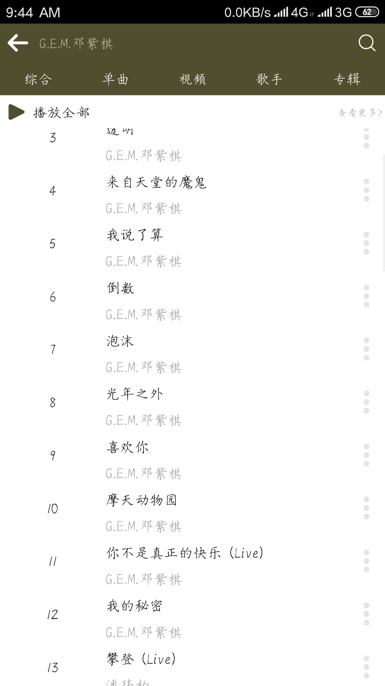
## Open source license:
- This project is released under the Apache-2.0 agreement, please refer to the license file
