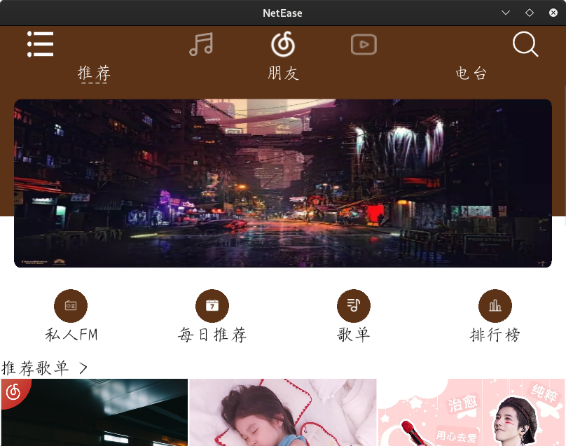

# NCMusic

** Cross-platform music player for mobile, developed using Python **

** 使用Python开发的手机跨平台音乐播放器 **

NCMusic is a music player that mimics the design of Netease Cloud Music UI, and strives to synchronize with the data of Netease Cloud official website, so that users can use the software without losing the existing playlists.

## Installation:
- PC: clone the repository, run main.py after installing dependencies as needed

-PC：克隆存储库，根据需要安装依赖项后运行main.py

- Android: directly enter the bin folder and download the .apk file to install

-Android：直接进入bin文件夹并下载.apk文件进行安装

## Description:
The project is still in the development stage, and the implemented functions are:
- Log in with your phone number and sync user nickname, avatar, favorite music
- NetEase cloud native daily song list recommendation
- Native Daily Music Singles Recommendation
- Add favorite / delete favorite songs
- Listen while saving, all songs will be automatically cached after playing, and will be automatically loaded from local when playing again
- Night mode
- Personalized skin

The interfaces that have been basically developed so far are:
- Login interface
- User interface
- Left toolbar
- Playlist recommendation page

The interface has been developed but is not complete (with the required functions but the interface has not been beautified):
- Song details interface (lyrics interface)
- Search interface
- Playlist details page

Interface that has not started or developed very little:
- Video playback interface
- "Friends" "Radio" "Live" "Video" interface

> Explanation for most undeveloped interfaces: No relevant api was found and most users did not have much demand for it.

该项目仍处于开发阶段，实现的功能为：

-使用您的电话号码登录并同步用户昵称，头像，喜欢的音乐

-网易云原生每日歌曲列表推荐

-本地每日音乐单打推荐

-添加收藏/删除喜欢的歌曲

-保存时收听，所有歌曲将在播放后自动缓存，并在再次播放时从本地自动加载

- 夜间模式

-个性化皮肤

到目前为止，已经基本开发的接口是：

-登录界面

- 用户界面

-左侧工具栏

-播放列表推荐页面

接口已开发，但不完整（具有所需功能，但尚未美化接口）：

-歌曲详细信息界面（歌词界面）

-搜索界面

-播放列表详细信息页面

尚未启动或开发的接口很少：

-视频播放界面

-“好友”“广播”“直播”“视频”界面

>大部分未开发接口的说明：未找到相关的api，并且大多数用户对此没有太多需求。

## Approximate interface display:

### Android side:
- Login:
- Main interface:
- Sidebar:
- Recommended playlist:
- Song detail page:
- Playlist detail page:
- Search interface:

### PC side:

- Login:

- Main interface:
- Sidebar:
- Recommended playlist:

- Song detail page:

- Playlist detail page:
- Search interface:
- Night mode:

## Open source license:
- This project is released under the Apache-2.0 agreement, please refer to the license file

